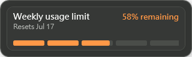
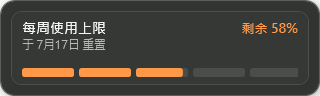

# Codex Usage Companion

[English](README.md) · [简体中文](README.zh-Hans.md)

Codex Usage Companion 是開放原始碼 Windows 外掛，會在 Codex Desktop 右下角顯示簡潔的剩餘使用量面板。

## 畫面預覽

| English | 繁體中文 | 简体中文 |
| --- | --- | --- |
|  |  |  |

## 功能

- 送出訊息時與 Codex 回覆後都會更新，並透過本機通知與每三分鐘備援更新保持資料同步。
- 從 v0.3.5 開始，獨立且不顯示視窗的 Windows 排程檢查會在 Codex 重新啟動或常駐程序退出後約三分鐘內恢復外掛，即使 Codex Hook 沒有執行也能恢復。
- Codex 關閉時不會保留額外監控程序；每次排程檢查完成後立即退出。
- 永遠只保留一個常駐程序，不會出現在工作列、Alt+Tab 或系統匣。
- 面板會跟隨 Codex 視窗；Codex 最小化時隱藏，Codex 關閉後自動結束。
- 使用五格 HP Bar，以綠、黃、橘、紅、灰色快速表示剩餘比例。
- 支援英文、繁體中文、簡體中文。
- 五小時使用量功能完整保留，但預設隱藏。
- 只讀取本機 Codex app-server，不會儲存驗證 Token。
- 沒有遙測、分析或外部服務。

## 需求

- Windows 10 或更新版本，x64
- Codex Desktop

Release 已包含所需執行環境，不必另外安裝 .NET Runtime。

## 從 GitHub 安裝

> [!TIP]
> **不想閱讀完整說明？**
>
> 直接把 `https://github.com/gkfriend/codex-usage-companion` 貼給 Codex，然後告訴它：
>
> 「請閱讀這個專案的安裝說明，幫我安裝並啟用 Codex Usage Companion。」
>
> Codex 會協助完成大部分安裝步驟。若出現權限或 `/hooks` 信任確認，依畫面核准即可。

執行：

```powershell
codex plugin marketplace add gkfriend/codex-usage-companion
```

開啟 Codex 外掛目錄，選擇 **Codex Usage Companion**，檢視並信任內含的三個 Hook（`SessionStart`、`UserPromptSubmit` 與 `Stop`），然後安裝並啟用。安裝後請開啟新的 Codex 對話。每次更新後，若 Codex 再次要求確認，請開啟 `/hooks` 並重新信任目前的 Hook 定義。

也可以從 GitHub Releases 下載 Marketplace ZIP，解壓縮後執行 `codex plugin marketplace add <資料夾>`。

## 自動恢復

進入已安裝的 Codex Usage Companion 外掛目錄後執行：

```powershell
powershell -ExecutionPolicy Bypass -File .\scripts\install-recovery.ps1
```

這會建立目前使用者專用的隱藏排程 `\CodexUsageCompanion\Recovery`、立即啟動，並透過不顯示主控台的 Windows Script Host 啟動器每三分鐘檢查一次。不需要系統管理員權限，也不會留下常駐 PowerShell 程序；原有 Hook 仍負責即時啟動與更新。

若只想移除自動恢復，但保留外掛、設定與記錄檔：

```powershell
powershell -ExecutionPolicy Bypass -File .\scripts\uninstall-recovery.ps1
```

## 設定

外掛會在 Codex 外掛資料目錄建立 `settings.json`；若無法使用該目錄，則使用 `%LOCALAPPDATA%\CodexUsageCompanion\settings.json`。

```json
{
  "showFiveHourLimit": false,
  "language": "auto",
  "position": "bottom-right",
  "opacity": 1.0,
  "margin": 16
}
```

語言可設為 `auto`、`en`、`zh-Hant`、`zh-Hans`。

位置可設為 `top-left`、`top-right`、`bottom-left`、`bottom-right`。

透明度範圍為 `0.5`–`1.0`，邊距範圍為 `0`–`64` 像素。

## 自行建置

安裝 .NET 8 SDK 後執行：

```powershell
pwsh -File scripts/build.ps1
```

腳本會執行 Release 測試、建立自包含單檔 `win-x64` 程式、驗證 Marketplace ZIP，並將 ZIP 與 SHA-256 放在 `artifacts`。

## 相容性

此外掛使用 Codex 實驗性的本機 app-server 使用量 API。未來 Codex 更新可能需要同步調整。暫時性錯誤會保留最後一次有效數值，診斷資料只寫入本機且有容量限制的記錄檔。

隱私與授權請參閱 [PRIVACY.md](PRIVACY.md)、[SECURITY.md](SECURITY.md) 與 [MIT License](LICENSE)。
